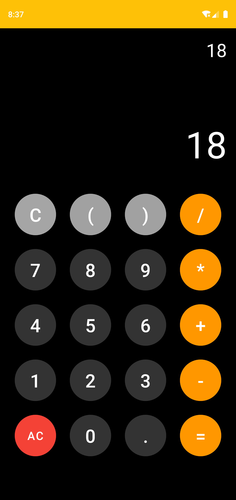
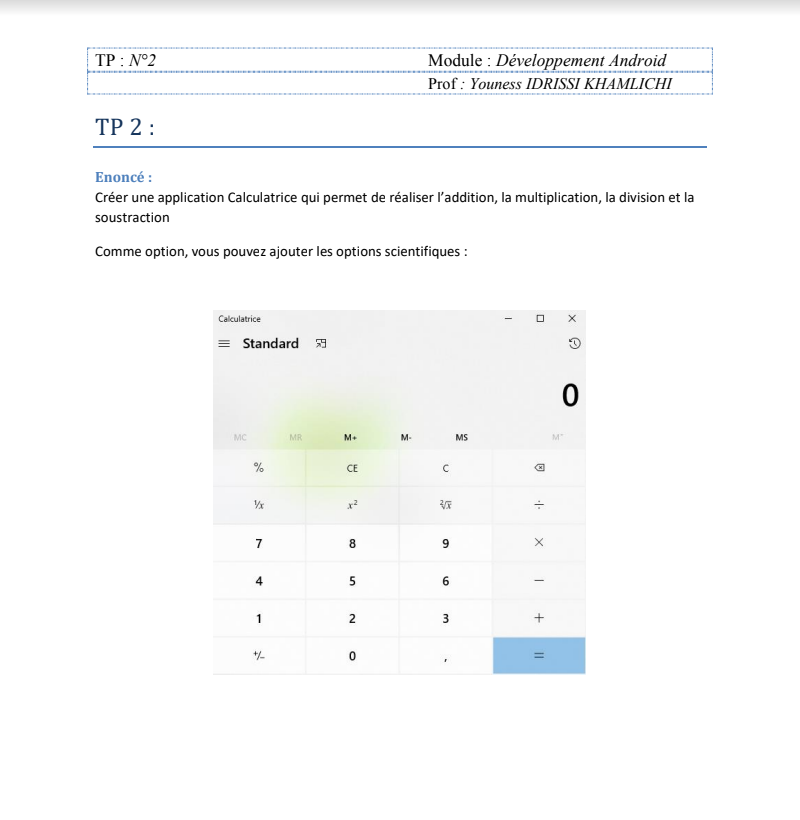

# Project JAVA MASTER CalculatorAndroid
Application de calculatrice entièrement fonctionnelle dans Android Studio

Ce projet donne à un utilisateur de faire des calcules,  (Addition, Soustraction, Multiplicatin, Division )

### Stack

* Java

## Screenshots

 
 

## Subject

[Subject](https://drive.google.com/drive/folders/1dxzNfMapYn1o6dhBe7O5s650TrPJVceV?hl=fr) 
